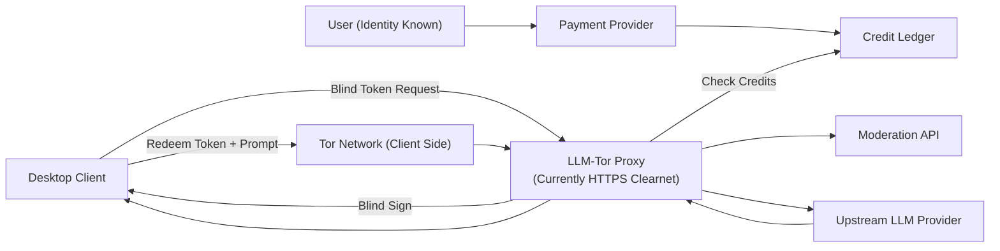
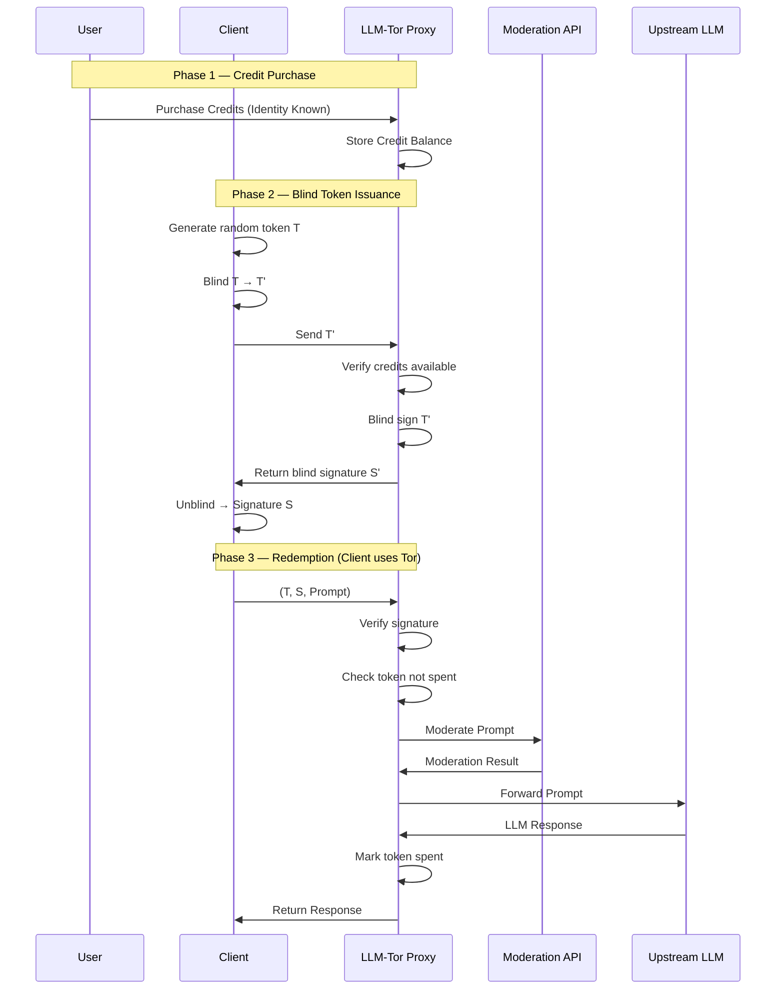
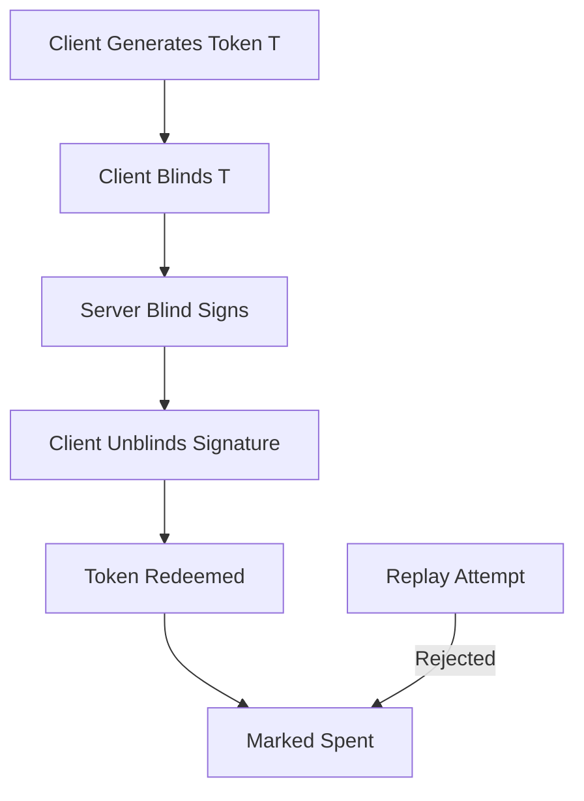

# LLM-Tor

LLM-Tor is a privacy-preserving proxy layer for public LLM APIs.

It cryptographically separates payment identity from model usage using blind signatures and Tor routing so that even
LLM-Tor cannot link identity between users and their chat content.

To build the desktop-client from source, please check README in the directory `/desktop-client`.

## Why?

Public LLM APIs link prompts to user accounts.

LLM-Tor breaks this linkage.

## How It Works

1. User buys credits.
2. Client generates blind tokens.
3. Server blind-signs tokens.
4. Client redeems tokens over Tor.
5. Server verifies signature and forwards to LLM.

The server cannot link usage to identity.

Note:
The LLM inference proxy currently operates over standard HTTPS. But the desktop client accesses
it via tor exit node only. Onion only deployment is planned.

## Security Properties

- Blind RSA unlinkability
- Single-use tokens
- Tor-based anonymity
- No chat persistence

## Threat Model

Protects against:
- Proxy linking identity to prompt

Does not protect against:
- Upstream LLM provider logging the "content"
- Global network adversary

## Whitepaper

See whitepaper.pdf at the root of the repo.

## Architecture

### High-Level Architecture



## End-to-End Protocol Flow



### Token Lifecycle



## License

See LICENSE file in this directory.
For desktop-client, a separate license is present in its directory.

## Public Keys For Clients
Technically any custom client can interact with the LLMTor backend. The public keys used by the models are present at:
`desktop-client/src/types/config.ts`

## Pricing

```
┌──────────────────┬─────────────┬─────────────┐                                                                                                                                                                                                                      
│      Model       │    $5.00    │   $15.00    │
├──────────────────┼─────────────┼─────────────┤                                                                                                                                                                                                                      
│ gemini-2.5-flash │ 150 credits │ 450 credits │          
├──────────────────┼─────────────┼─────────────┤
│ gemini-2.5-pro   │ 80 credits  │ 250 credits │
├──────────────────┼─────────────┼─────────────┤
│ gpt-4.1-mini     │ 180 credits │ 550 credits │
├──────────────────┼─────────────┼─────────────┤
│ gpt-4.1          │ 80 credits  │ 250 credits │
└──────────────────┴─────────────┴─────────────┘
```

## Development
### Build

- Build backend locally:
    - `make build`

### Docker Image

- Build image:
    - `make docker-image`
- Run image:
    - `docker run --rm -p 8080:8080 llmmask-server:latest`

### Build Script

- Local image:
    - `./scripts/build-image.sh local`
- Prod image:
    - `./scripts/build-image.sh prod <repo/image> <tag>`

### Azure Deploy Script

- First deploy (creates/updates RG, ACR, Container Apps env/app):
    - `az login`
    - `AZ_ACR_NAME=<uniqueacrname> ./scripts/azure-containerapp.sh deploy`
- Redeploy new image to existing app:
    - `AZ_ACR_NAME=<sameacrname> ./scripts/azure-containerapp.sh redeploy`
- Update only environment variables (no image rebuild/push):
    - `AZ_ACR_NAME=<sameacrname> ./scripts/azure-containerapp.sh env-only`
- Load settings/app env vars from local `.env` (default):
    - `./scripts/azure-containerapp.sh deploy`
    - Script auto-loads `.env` unless `LOAD_ENV_FILE=0`
- Use a different env file:
    - `ENV_FILE=.env.prod ./scripts/azure-containerapp.sh deploy`
- Optional vars:
    - `AZ_RG`, `AZ_LOCATION`, `AZ_CA_ENV_NAME`, `AZ_CA_APP_NAME`, `AZ_IMAGE_REPO`, `AZ_IMAGE_TAG`
    - `AZ_RG_LOCATION`, `AZ_ACR_LOCATION`, `BUILD_PLATFORM`, `BUILD_CACHE_REF`, `SKIP_IF_EXISTS`
    - `PROD_CREDENTIALS_CONFIG`, `PROD_CREDENTIALS_CONFIG_FILE`

Example `.env`:
```dotenv
AZ_ACR_NAME=myacrname
AZ_RG=my-existing-rg
AZ_LOCATION=westus2
AZ_CA_APP_NAME=llmmask
AZ_IMAGE_TAG=prod-v1
API_BASE_URL=https://your-app.example.com
PROD_CREDENTIALS_CONFIG={...}
```

### GitHub Actions Auto-Deploy

- Workflow file:
    - `.github/workflows/azure-containerapp-deploy.yml`
- Trigger:
    - On push to `main` and `master`
- Deploy command used by workflow:
    - `AZ_RG=... AZ_LOCATION=... AZ_ACR_NAME=... ./scripts/azure-containerapp.sh redeploy`

### Configure GitHub Secrets / Variables

1. Add repository variables (`Settings -> Secrets and variables -> Actions -> Variables`):
    - `AZ_RG` (example: `llmmaskprod`)
    - `AZ_LOCATION` (example: `westus2`)
    - `AZ_ACR_NAME` (example: `llmmaskacr`)
2. Configure Azure auth (choose one):
    - Option A: secret `AZURE_CREDENTIALS` with the full service principal JSON for `azure/login`.
    - Option B (OIDC): secrets `AZURE_CLIENT_ID`, `AZURE_TENANT_ID`, `AZURE_SUBSCRIPTION_ID`.
3. Add secret `DEPLOY_ENV_FILE` containing the full `.env` file content (multi-line).
    - The workflow writes this secret to `.env` before running the deploy script.
